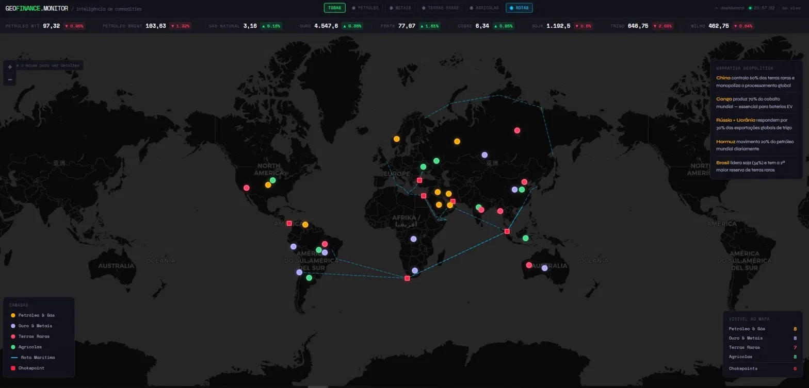

[README_vitrine.md](https://github.com/user-attachments/files/28114019/README_vitrine.md)
<div align="center">

# 🌍 GeoFinance Monitor

### Plataforma de Inteligência Geopolítica Financeira

[](https://geofinance-monitor.vercel.app)
[](https://geofinance-api.onrender.com/docs)
[]()

> Monitoramento em tempo real de eventos geopolíticos e seus impactos nos mercados globais de commodities.

</div>

---

## 📸 Screenshots

### Dashboard Principal

*Feed de notícias classificadas por IA com impacto nos ativos financeiros*

### Mapa Interativo de Commodities

*31 países mapeados com preços ao vivo, risco geopolítico e dependência da China*

### Chokepoints e Rotas Marítimas

*Estreito de Hormuz, Malaca, Suez — os pontos críticos do comércio global*

### Popup de País com Dados Estratégicos

*Cada país exibe: produção, empresas, risco geopolítico, exposição à China e preço live*

---

## 🎯 O que é

GeoFinance Monitor conecta **eventos geopolíticos** com **impactos nos mercados financeiros** em tempo real.

Eventos geopolíticos movem mercados:
- A guerra na Ucrânia derrubou o trigo
- Sanções ao Irã elevaram o petróleo
- O controle chinês das terras raras define a geopolítica das baterias EV
- Bloqueio de Hormuz pode paralisar 20% do petróleo mundial

Este projeto mapeia essas conexões automaticamente.

---

## ⚙️ Funcionalidades

### 📰 Dashboard
- Coleta automática de **Reuters, BBC, Bloomberg, Financial Times**
- Classificação por IA: **energia, guerra, juros, comércio**
- Impacto mapeado por ativo financeiro
- Atualização em tempo real

### 🗺️ Mapa de Commodities
- **4 camadas**: Petróleo & Gás · Ouro & Metais · Terras Raras · Agrícolas
- **Preços ao vivo**: WTI, Brent, Ouro, Prata, Cobre, Soja, Trigo, Milho
- **Chokepoints**: Hormuz, Malaca, Suez, Bósforo, Panamá
- **Rotas marítimas** dos principais corredores de commodities
- **Risco geopolítico** e **dependência da China** por país
- Empresas relevantes em cada região

### 🔌 API REST
```
GET /events     → notícias classificadas com impactos
GET /prices     → preços reais de commodities
GET /stats      → estatísticas do banco
GET /docs       → documentação interativa
```

---

## 🛠️ Stack

```
Python · FastAPI · SQLite · feedparser · httpx
HTML · CSS · JavaScript · Leaflet.js
OpenRouter API (LLM) · Yahoo Finance
GitHub · Render · Vercel
```

---

## 🌐 Links

| | |
|---|---|
| 🖥️ Dashboard ao vivo | [geofinance-monitor.vercel.app](https://geofinance-monitor.vercel.app) |
| 🗺️ Mapa de Commodities | [geofinance-monitor.vercel.app/mapa.html](https://geofinance-monitor.vercel.app/mapa.html) |
| 🔌 API Docs | [geofinance-api.onrender.com/docs](https://geofinance-api.onrender.com/docs) |

---

## 👤 Autor

**Mykola Cristofolini**

Relações Internacionais · Geopolítica · Data Analytics · Visualização de Dados

Fluente em Português · Russo · Inglês

[](https://linkedin.com/in/SEU-PERFIL-AQUI)
[](https://github.com/ncristofolini-ops)

---

<div align="center">

*Este repositório é uma vitrine pública do projeto.*
*O código-fonte completo está disponível mediante contato.*

© 2026 Mykola Cristofolini — Todos os direitos reservados.

</div>
